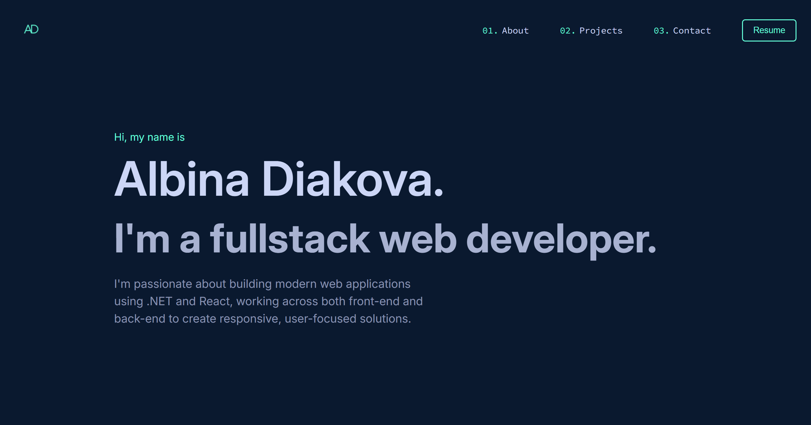
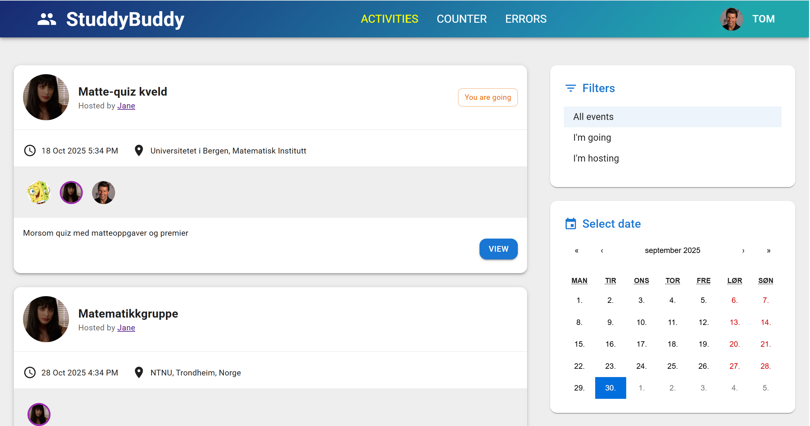
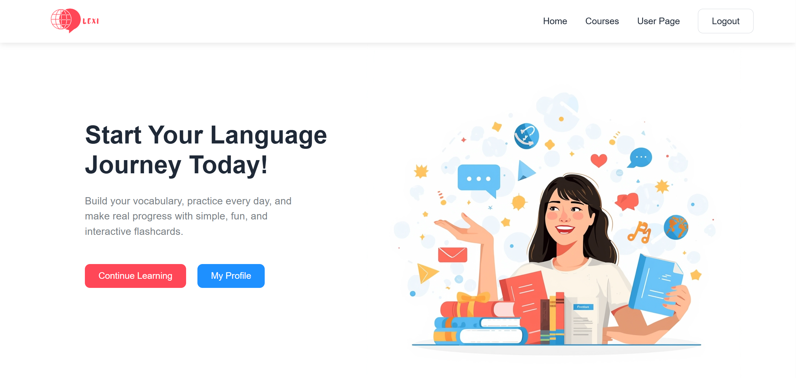

# Hi, I'm Albina!✨

I am a recent **Bachelor graduate in IT and Management** from USN (2022–2025).  
I am passionate about **full-stack development**, **web applications**, and learning new technologies.  

- 💻 I work with **React, TypeScript, .NET, and C#**  
- 🌱 I’m currently improving my **full-stack development skills** while **looking for a job as a developer**  
- 📫 You can reach me via [email](mailto:dyakovabina@gmail.com)  

Feel free to check out my projects below! 🚀

# 💻 Tech Stack:

# 📊 GitHub Stats:

# 🚀 Latest Projects

  
  
  
  

